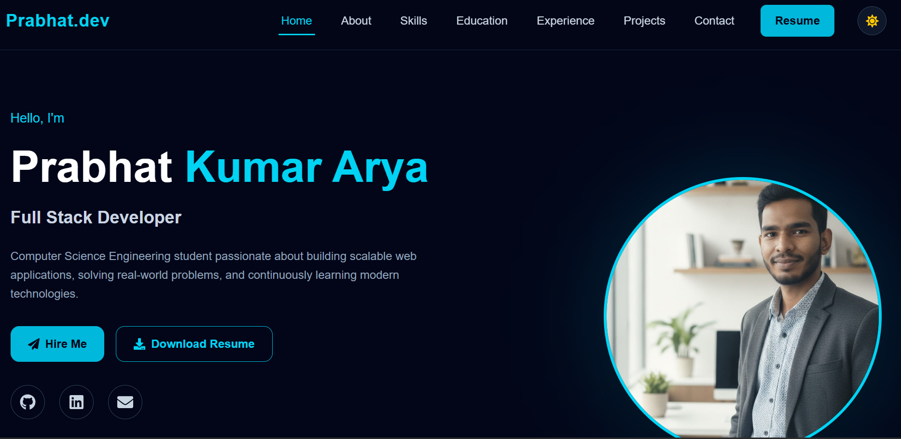
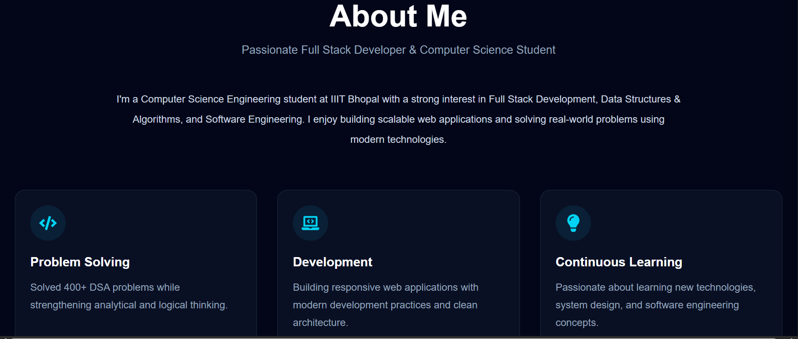
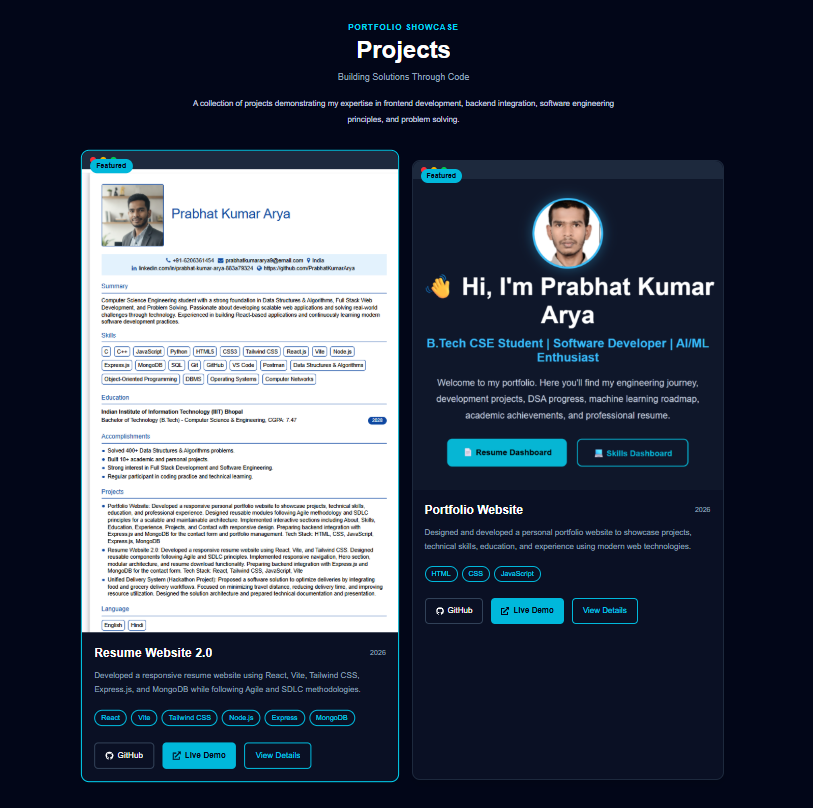
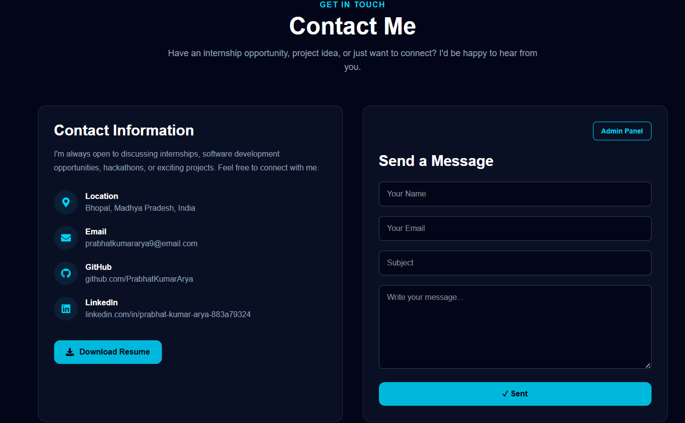
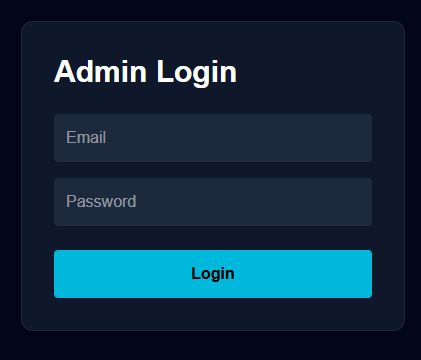
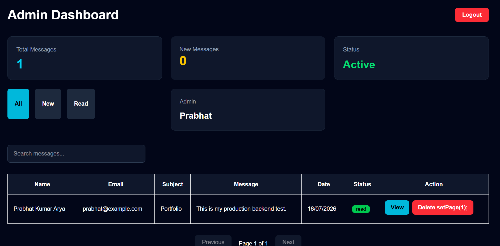

# ⚛️ Resume Frontend

A modern, responsive, and interactive **React + Vite** frontend for my personal portfolio website. This application showcases my skills, projects, education, and experience while providing an elegant user interface for visitors to connect with me. It also includes an Admin Login interface for accessing the portfolio management dashboard.

---

# 🚀 Live Demo

**Frontend:** *([https://resume-website-2-0.vercel.app/])*

---

# ✨ Features

## Portfolio

- Responsive modern UI
- Hero Section
- About Me
- Skills
- Education
- Experience
- Projects Showcase
- Contact Form
- Resume Download
- Smooth scrolling navigation
- Framer Motion animations
- Mobile-friendly layout

---

## Contact

- Contact form validation
- API integration using Axios
- Success & error notifications
- Loading state while sending messages

---

## Admin

- Admin Login page
- Protected Dashboard Route
- JWT Token Support
- Dashboard UI
- Message Management Interface

---

# 🛠 Tech Stack

- React 19
- Vite
- Tailwind CSS
- Framer Motion
- Axios
- React Router DOM

---

# 🏗 Frontend Architecture

```text
                Browser
                   │
                   ▼
          React + Vite Application
                   │
         React Router DOM Navigation
                   │
                   ▼
           Axios API Communication
                   │
                   ▼
            Express.js Backend API
```

---

# 📁 Project Structure

```text
frontend/
│
├── public/
│   ├── favicon.svg
│   ├── icons.svg
│   └── resume/
│       └── My_Resume.pdf
│
├── src/
│   ├── admin/
│   ├── api/
│   ├── assets/
│   ├── components/
│   ├── config/
│   ├── constants/
│   ├── data/
│   ├── layouts/
│   ├── pages/
│   ├── routes/
│   ├── services/
│   ├── styles/
│   ├── theme/
│   ├── utils/
│   ├── App.jsx
│   ├── main.jsx
│   └── index.css
│
├── .gitignore
├── eslint.config.js
├── index.html
├── package.json
├── package-lock.json
├── vite.config.js
└── README.md
```

---

# 📂 Folder Description

| Folder | Purpose |
|---------|----------|
| `admin/` | Admin Login, Dashboard & Protected Routes |
| `api/` | Axios configuration |
| `assets/` | Images, Icons, Resume, Fonts |
| `components/` | Reusable React Components |
| `config/` | Frontend Configuration |
| `constants/` | Application Constants |
| `data/` | Portfolio Data |
| `layouts/` | Main Layout |
| `pages/` | Application Pages |
| `routes/` | React Router Configuration |
| `services/` | API Services |
| `styles/` | Global Styles |
| `theme/` | Theme Configuration |
| `utils/` | Helper Functions |

---

# ⚙ Installation

## Clone Repository

```bash
git clone https://github.com/PrabhatKumarArya/resume-website-2.0.git
```

```bash
cd resume-website-2.0/frontend
```

---

## Install Dependencies

```bash
npm install
```

---

# 🔑 Environment Variables

Create a `.env` file inside the frontend directory.

```env
VITE_API_URL=http://localhost:5000/api
```

---

# ▶ Available Scripts

### Start Development Server

```bash
npm run dev
```

Runs the application locally.

---

### Production Build

```bash
npm run build
```

Creates an optimized production build.

---

### Preview Production Build

```bash
npm run preview
```

Preview the production build locally.

---

### Run ESLint

```bash
npm run lint
```

Checks code quality and linting issues.

---

# 🌍 Deployment

- **Hosting:** Vercel
- **Build Tool:** Vite
- **Automatic Deployment:** GitHub → Vercel
- **API:** Express.js Backend

---

# 📸 Screenshots

## 🏠 Home



---

## 👤 About



---

## 🚀 Projects



---

## 📬 Contact



---

## 🔐 Admin Login



---

## 📊 Admin Dashboard



---

# 🚀 Future Improvements

- Dark / Light Theme Toggle
- Blog Section
- Project Search
- Project Categories
- Multi-language Support
- Progressive Web App (PWA)
- Unit Testing
- Performance Optimization
- Accessibility Improvements

---

# 🤝 Contributing

Contributions, suggestions, and improvements are always welcome.

1. Fork the repository
2. Create a new branch
3. Commit your changes
4. Push your branch
5. Open a Pull Request

---

# 👨‍💻 Author

**Prabhat Kumar Arya**

📧 Email: prabhatkumararya9@gmail.com

💼 LinkedIn: https://linkedin.com/in/prabhat-kumar-arya-883a79324

💻 GitHub: https://github.com/PrabhatKumarArya

---

# 📄 License

This project is licensed under the **MIT License**.

---

## ⭐ Show Your Support

If you found this project helpful, consider giving it a ⭐ on GitHub. It helps others discover the project and motivates future improvements.